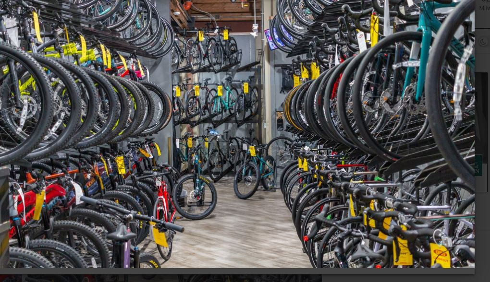
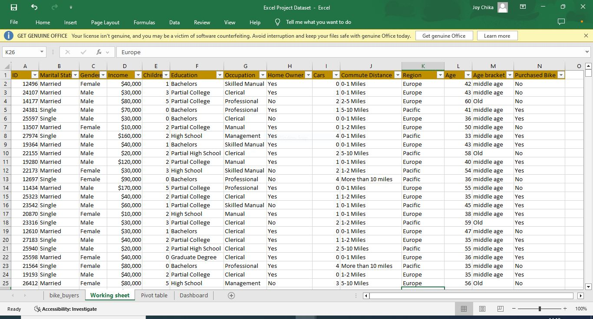
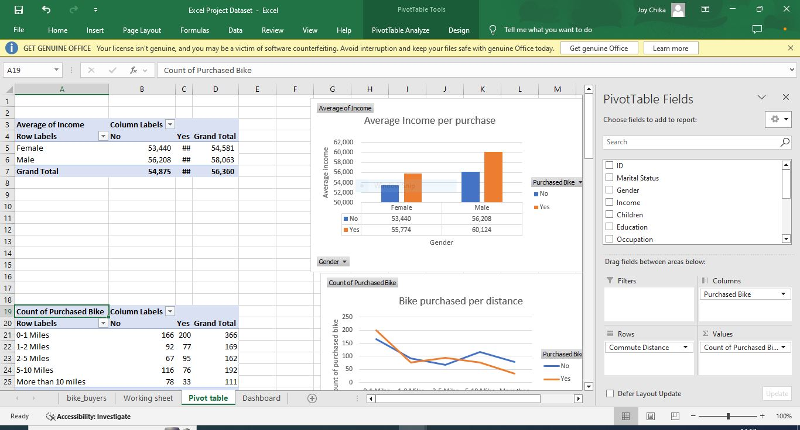
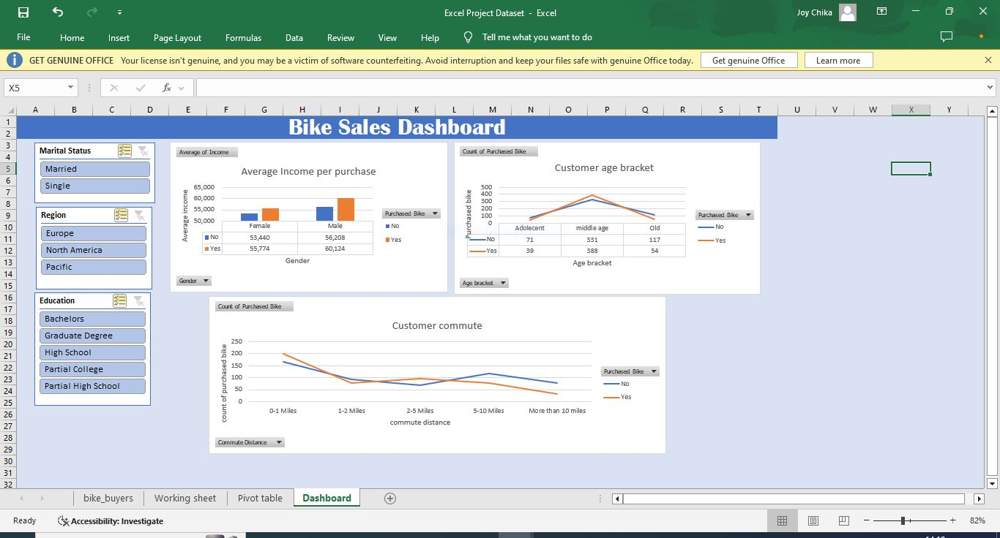

# Bike Store Analysis

___

## Introduction
This Excel project focuses on an imaginary store named **Bike Store**. The goal is to analyze the demographics of the people in the store's vicinity. This analysis will help the store owner make informed decisions and guide the business toward success and growth. 

**_Disclaimer_**: _All dataset or report do not represent any company, organization, institution or country. But just a dummy dataset to represent the capabilities of Excel_

## Problem Statement
1. What is the average income of individuals per bike purchased?
2. What is the age bracket of individuals who purchased a bike?
3. What distance was covered for individuals to purchase a bike?

## Skills / Concept Demostrated
The following Excel features were learned and utilized
- Data cleaning
- Data sort/filter
- Excel formula
- Pivot table
- Dashboard creation

### Bike store dataset

___
## Visualization
The report comprise two pages
- Pivot table
- Dashboard

### Pivot table
      

### Bike store dashboard

## Observation
- The average income of females who purchased a bike is $55,774, compared to $53,440 for females who did not purchase a bike. For males, the average income is $60,124 for those who bought a bike, versus $54,208 for those who did not.
- The customer age groups frequenting the Bike Store include adolescents, middle-aged individuals, and old. The analysis reveals that middle-aged customers purchase more bikes than both adolescents and old.
- The analysis of purchase distances indicates that individuals who live closer to the store are more likely to make purchases. This tendency decreases as the distance from the store increases.
  
## Conclusion 
This analysis has highlighted the major factors such as income, age and distance which are the driving force of profit for "Bike Store".

## Recommendation
Bikes with lower prices can be marketed to individuals with lower incomes, while high-end bikes can attract adolescents with more interest in premium products. Additionally, incorporating AI-equipped bikes could appeal to older customers. To further boost sales, opening additional **Bike Store** locations in various areas can make the store more accessible and convenient for customers.

